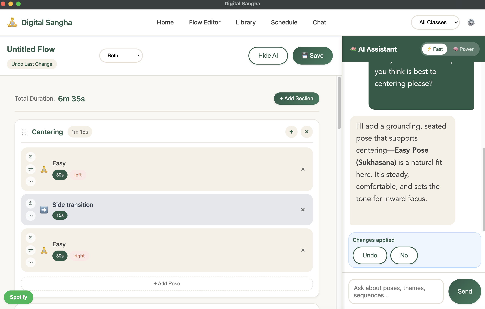
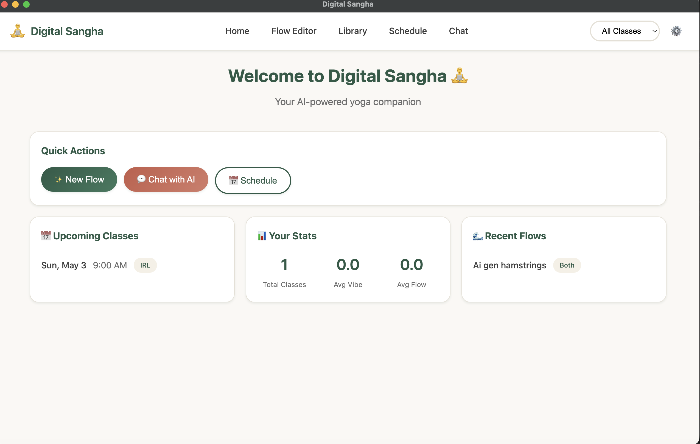
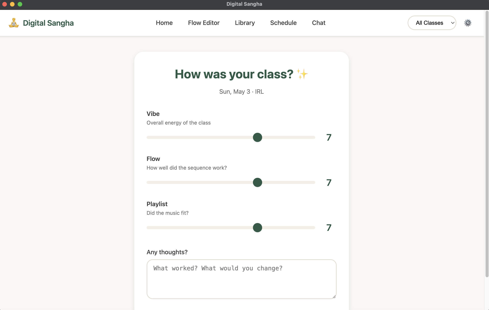
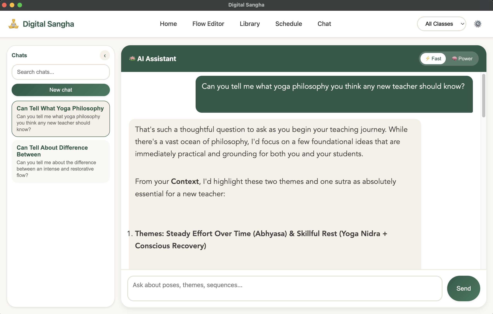
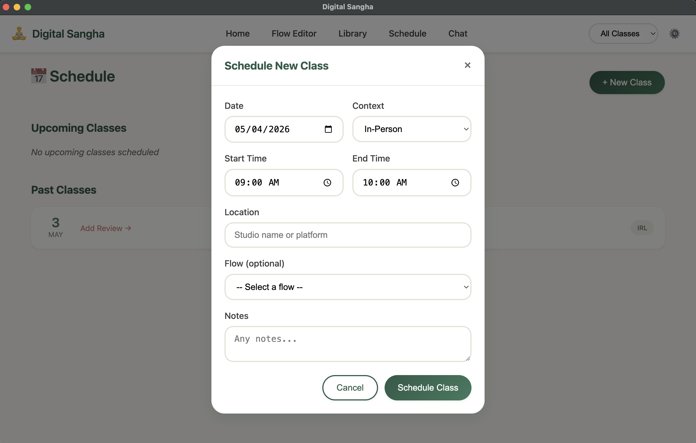

# Digital Sangha

[](https://github.com/Rsan0948/digital-sangha/actions/workflows/ci.yml)
[](LICENSE)
[](https://github.com/Rsan0948/digital-sangha/releases)
[](https://github.com/Rsan0948/digital-sangha/actions/workflows/ci.yml)

Local AI companion for designing and running yoga flows. FastAPI + SQLite
backend, Svelte + Vite frontend, optional Electron desktop shell. Cloud LLMs
are optional; everything runs on your machine.



<details>
<summary>More screenshots</summary>

### Home


### Library


### Chat


### Schedule


</details>

## Highlights

- **Production middleware stack.** Custom ASGI middleware for payload size limits (5 MB cap, env-configurable), default web-hardening headers (CSP, X-Frame-Options, Referrer-Policy, Permissions-Policy), and a stdlib token-bucket rate limiter on admin endpoints — no `slowapi` dep. See [`backend/main.py`](backend/main.py) and [`docs/architecture.md`](docs/architecture.md) §5.
- **Schema discipline via alembic.** No `metadata.create_all` on startup. Every schema change is a versioned migration; `run_sangha.py` applies `alembic upgrade head` before launch unless explicitly skipped. Baseline at [`backend/migrations/versions/0001_initial_schema.py`](backend/migrations/versions/0001_initial_schema.py).
- **Local-only threat model, made explicit.** Loopback bind by default, Spotify OAuth state CSRF validation, WebSocket origin allowlist, atomic Fernet key write under `umask(0o077)`, ZIP-slip-safe data import. Documented in [`SECURITY.md`](SECURITY.md) and [`docs/architecture.md`](docs/architecture.md) §4.

## Quick Start — Web App

```bash
pip install -r backend/requirements.txt
(cd frontend && npm install)
python run_sangha.py --mode dev
```

Opens the dev frontend at http://localhost:5173 and the backend at
http://127.0.0.1:8000.

## Quick Start — Desktop App

```bash
python run_sangha.py --mode desktop
```

or, equivalently:

```bash
cd desktop && npm install && npm start
```

## Configuration

Three ways, in priority order:

1. The first-run wizard at http://localhost:5173/settings — recommended.
2. Copy the example file and edit it: `cp config.example.yaml config.yaml`.
   The real `config.yaml` is gitignored.
3. Environment variables for cloud keys:
   `OPENAI_API_KEY`, `ANTHROPIC_API_KEY`, `GOOGLE_API_KEY`, `DEEPSEEK_API_KEY`.

The Fernet encryption key is auto-generated on first run and stored at
`data/encryption.key` (gitignored). Do not commit it.

## Datasets

The Library, Flow Editor, AI Assistant, and playlist generator all read from
four reference datasets under `data/raw/` (poses, themes, sutras, Spotify
tracks). None ship with the repo — bring your own. See
[`docs/datasets.md`](docs/datasets.md) for schemas, public sources (Hugging
Face datasets, public-domain sutra translations, etc.), and the licensing
audit checklist.

Quickstart once `data/raw/` is populated:

```bash
python scripts/ingest_poses.py
python scripts/ingest_themes.py
python scripts/ingest_sutras.py
python scripts/ingest_spotify_tracks.py
python scripts/build_embeddings.py
```

## Architecture

FastAPI backend with SQLite (via SQLModel, alembic-migrated) and a Chroma
vector store. Svelte + Vite frontend, with an optional Electron desktop
shell. Everything runs locally; cloud LLM providers are opt-in via the
configuration above.

For the full topology, data flow, storage layout, security model, and key
design decisions, see [`docs/architecture.md`](docs/architecture.md).

## Releases

Tagged releases are published at https://github.com/Rsan0948/digital-sangha/releases.
Each release ships a built tarball generated by `.github/workflows/release.yml`.

To cut a release, tag `vX.Y.Z` on `main`. CI builds the frontend and publishes
the tarball with notes pulled from the matching `CHANGELOG.md` section.

To build local desktop binaries:

```bash
cd desktop && npm install && npm run dist:mac    # or :win, :linux
```

## License

[MIT](LICENSE).
